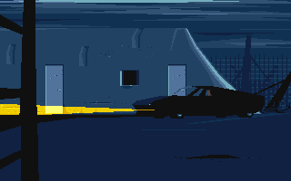
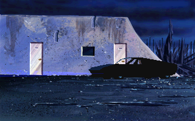

# raw(gl) - Another World Interpreter

rawgl is a re-implementation of the engine used in the game Another World.

 

## Supported Versions

The program requires the original data files.

- Amiga (Bank*)
- Atari (Bank*)
- Atari demo (AW.TOS)
- DOS (Bank*, memlist.bin)
- DOS demo (Demo*, memlist.bin)
- 15th Anniversary Edition (Data/Pak01.pak, Menu/, Music/)
- 20th Anniversary Edition (game/)
- Windows 3.1 (Bank, *mid)
- 3DO (GameData/ or .ISO)

## Running

By default, the engine tries to load the game data files from the current
directory. This can be changed with command line switches.

```
  Usage: rawgl [OPTIONS]...
    --datapath=PATH   Path to data files (default '.')
    --language=LANG   Language (fr,us,de,es,it)
    --part=NUM        Game part to start from (0-35 or 16001-16009)
    --render=NAME     Renderer (original,software,gl)
    --window=WxH      Windowed display size (default '640x400')
    --fullscreen      Fullscreen display (stretched)
    --fullscreen-ar   Fullscreen display (16:10 aspect ratio)
    --ega-palette     Use EGA palette with DOS version
    --demo3-joy       Use inputs from 'demo3.joy' (DOS demo)
    --difficulty=DIFF Difficulty (easy,normal,hard)
    --audio=AUDIO     Audio (original,remastered)
```

In game hotkeys :

```
  Arrow Keys      move Lester
  Enter/Space     run/shoot
  C               enter a code to start at a specific position
  P               pause the game
  Alt X           exit the game
```

## Technical Details

- [Amiga/DOS](docs/Amiga_DOS.md)
- [3DO](docs/3DO.md)
- [WiiU](docs/WiiU.md)
