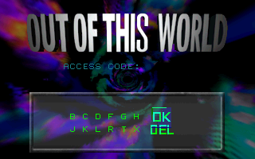

# Another World 3DO Technical Notes

Another World has been ported on many platforms. The way the game was written (interpreted game logic) clearly helped.

This document focuses on the 3DO release made by Interplay in 1994. This version was not a straight port. In addition to reworking the assets, the game code was modified.

Most of the information presented here was found by studying the binary code and assets. Some of it applies to the original versions.
The bits of assembly game code were generated using the "disasm" tool.

## Assets

Type     | Amiga/DOS | 3DO
-------- | --------- | ---
Music    | 4 channels tracker with raw signed 8bits samples (3 files) | AIFF SDX2 compressed audio (30 files)
Sound    | raw signed 8bits mono (103 files)                          | AIFF signed 16 bits (92 files)
Bitmap   | 4 bits depth paletted 320x200 (8 files)                    | True-color RGB555 320x200 (139 files)
Bytecode | Big-endian (Motorola 68000)                                | Little-endian (ARMv3)

## Game Code

The game code is split in 9 different sections.

```
16000.asm - protection screen
16001_intro.asm
16002_eau.asm
16003_pri.asm
16004_cite.asm
16005_arene.asm
16006_luxe.asm
16007_final.asm
16008.asm - password screen
```

Each section can be used as a starting point by the engine, with _vars[0] set to start at a specific position within that section.



This is basically what the password screen does, it looks up the entered code and sets the section and starting position.

```
02E3: jmpIf(VAR(0x07) != 10, @0303)
02E9: jmpIf(VAR(0x08) != 2, @0303)
02EF: jmpIf(VAR(0x09) != 9, @0303)
02F5: jmpIf(VAR(0x0A) != 2, @0303)
02FB: VAR(0x00) = 10
02FF: updateResources(res=16002)
```

## Game Copy Protection

With the original Amiga/DOS version, the player has to lookup the associated symbols in the manual based on a random code.


In addition to checking if the symbols entered are the correct ones, the game code is setting a few variables which are checked during gameplay.

This was probably added to defeat game cracks that would simply bypass the game protection screen.

For reference, the game code expects these values :

```
    _scriptVars[0xBC] = 16;
    _scriptVars[0xC6] = 128;
    _scriptVars[0xF2] = _isAmiga ? 6000 : 4000;
    _scriptVars[0xDC] = 33;
```

The 3DO does not have any game protection screen, but interestingly the game code still contain checks related to the protection code.

```
16002_eau.asm:  00A4: jmpIf(VAR(0xE2) == 0, @479F)
16002_eau.asm:  17A8: jmpIf(VAR(0xDB) == 0, @17B3)
16002_eau.asm:  2787: jmpIf(VAR(0xE2) == 1, @479F)
16003_pri.asm:  2CE1: jmpIf(VAR(0xE2) != 1, @4B2E)
16003_pri.asm:  6D74: jmpIf(VAR(0xE2) == 0, @6D7C)
16003_pri.asm:  6DA6: jmpIf(VAR(0xE2) == 0, @6DAE)
16004_cite.asm: 0145: jmpIf(VAR(0xDB) == 0, @7952)
16006_luxe.asm: 1359: jmpIf(VAR(0xDB) == 0, @6E8A)
```

The engine sets the expected values on start :

```
if (_is3DO) {
    _scriptVars[0xDB] = 1;
    _scriptVars[0xE2] = 1;
    _scriptVars[0xF2] = 6000;
```


## Bytecode

The game engine is based on a virtual machine with 30 opcodes.

### Opcodes

The game was developed on an Amiga. As the Motorola 68000 CPU was big endian, this is the byte order found in the bytecode on the original Amiga/DOS versions.
Most of the opcodes operand size is 2 bytes, matching the register size of the target 68000 CPU.

* ALU

Num | Name | Parameters | Description
--- | ---- | ---------- | ---
0   | op_movConst | var: byte, value: word           | var := value
1   | op_mov      | var(dst): byte, var(src): byte   | dst := src
2   | op_add      | var(dst): byte, var(src): byte   | dst += src
3   | op_addConst | var: byte; value: word           | var += value
19  | op_sub      | var(dst): byte, var(src): byte   | var -= src
20  | op_and      | var: byte, value: word           | var &= value
21  | op_or       | var: byte, value: word           | var |= value
22  | op_shl      | var: byte, count: word           | var <<= count
23  | op_shr      | var: byte, count: word           | var >>= count

* Control flow

Num | Name | Parameters | Description
--- | ---- | ---------- | ---
4   | op_call     | offset: word            | function call
5   | op_ret      |                         | return from function call
7   | op_jmp      | offset: word            | pc = offset
9   | op_jmpIfVar | var: byte, offset: word | --var != 0: pc = offset (dbra)
10  | op_condJmp  | operator: byte, var(operand1): byte, operand2: byte/word, offset: word | cmp op1, op2: pc = offset

* Coroutines

Num | Name | Parameters | Description
--- | ---- | ---------- | ---
8   | op_installTask      | num: byte, offset: word            | setup a coroutine, pc = offset
6   | op_yieldTask        |                                    | pause current coroutine
12  | op_changeTasksState | num1: byte, num2: byte, state:byte | change coroutines num1..num2 state
17  | op_removeTask       |                                    | abort current coroutine

* Display

Num | Name | Parameters | Description
--- | ---- | ---------- | ---
11  | op_setPalette    | num: word                                        | set palette (16 colors)
13  | op_selectPage    | num: byte                                        | set current drawing page
14  | op_fillPage      | num: byte, color: byte                           | fill page with color
15  | op_copyPage      | num(dst): byte, num(src): byte                   | copy page content
16  | op_updateDisplay | num: byte                                        | present page to screen
18  | op_drawString    | num: word, x(/8): byte, y(/8): byte, color: byte | draw string

* Assets

Num | Name | Parameters | Description
--- | ---- | ---------- | ---
24  | op_playSound       | num: word, frequency: byte, volume: byte, channel: byte | play sound
25  | op_updateResources | num: word                                               | load asset resource or section
26  | op_playMusic       | num: word, pitch: word, position: byte                  | play music

### 3DO Specific Opcodes

The 3DO port does not use the same bytecode. The game code was modified, recompiled and saved under the target endianness of the target ARM CPU of the 3DO.
In the process, some opcodes have been added and some others have been optimized for size by using one byte operand when applicable.

The new shift opcode is a good example : the original bytecode was using a 16bits value to specify the number of bits to shift on the target 16 bits register.
8 bits were twice as enough.

Num | Name | Parameters | Description
--- | ---- | -----------| ---
11  | setPalette    | num: byte                                          |
22  | shiftLeft     | var: byte, count: byte                             | var <<= count
23  | shiftRight    | var: byte, count: byte                             | var >>= count
26  | playMusic     | num: byte                                          |
27  | drawString    | num: byte, var(x): byte, var(y): byte, color: byte |
28  | jmpIfVarFalse | var: byte, offset: word                            | if var == 0: pc = offset
29  | jmpIfVarTrue  | var: byte, offset: word                            | if var != 0: pc = offset
20  | sync?         |                                                    | this opcode is not referenced in the game code

## Resources

As any 3DO game, the data-files are read from an OperaFS CD-ROM.

Inside the GameData/ directory
* The game data-files are numbered from 1 to 340 (File%d)
* The song files (AIFF-C) are numbered from 1 to 30 (song%d)
* Three cinematics files : Logo.Cine, Spintitle.Cine, ootw2.cine

The files are stored uncompressed at the exception of the background bitmaps.
The decompression code can be found in the DOOM 3DO source code - [dlzss.s](https://github.com/Olde-Skuul/doom3do/blob/master/lib/burger/dlzss.s)

## Rendering

### Transparency

The engine can display semi-transparent shapes such as the car lights in the introduction.

 

The original Amiga/DOS game used a palette of 16 colors. The semi-transparency is achieved by allocating the upper half of the palette to the transparent colors.
The palette indexes 0 to 7 hold the scene colors, indexes 8 to 15 the blended colors.


Turning a pixel semi-transparent is simply done by setting to 1 the bit 3 of the palette color index (|= 8).

This is not directly applicable to the 3DO which renders everything with true-color buffers.
The 3DO engine leverages the console capabilities to render an alpha blended shape. Interestingly, the color of the lights is not yellow in that version.

 

### Background Bitmaps

While the original Amiga/DOS game relied on polygons for most of its graphics, the game engine supports using a raster bitmap to be used as the background.
In the original game version, this is only used for 8 different screens.

   

   

The 3DO version uses the feature for all the screens of the game. For comparison, the same screens in RGB555.

   

   

### Drawing Primitives

The original Amiga/DOS used only one primitive for all its drawing : a quad (4 vertices).

The 3DO reworked that format, probably to optimize shapes made of single pixels or straight lines.
The upper nibble of the shape color byte specifies the primitive to draw.

```
0x00 : nested/composite shape
0x20 : rectangle
0x40 : pixel
0xC0 : polygon/quad
```
