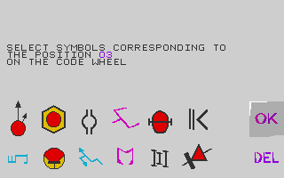
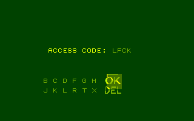
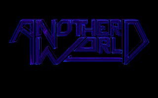
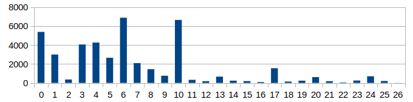
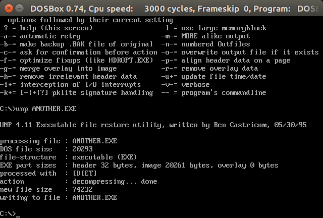
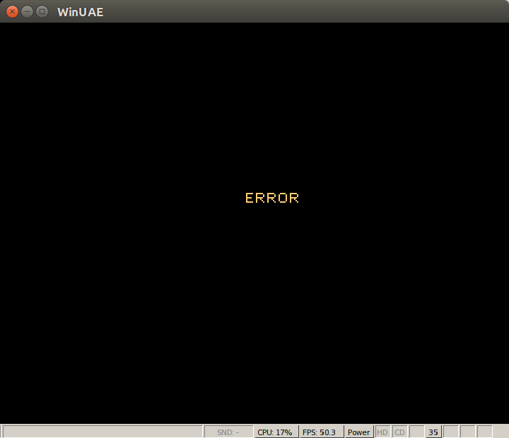

# Another World Amiga/DOS Technical notes

This document lists differences found in the Amiga and DOS executables and bytecode of Another World.

- [Game Copy Protection](#game-copy-protection)
- [Game Code](#game-code)
- [Variables](#variables)
- [Opcodes Dispatch](#opcodes-dispatch)
- [Data Files](#data-files)
- [Cracks](#cracks)

## Game Copy Protection

To prevent piracy, the game was bundled with a code wheel.

The player has to lookup the randomized symbols everytime the game starts.



After checking the symbols entered are the correct ones, a few variables are set and checked during gameplay.

This was probably added to defeat game cracks that would simply bypass the game protection screen.

The Amiga version bytecode checks 4 variables :

```
0081: VAR(0xBC) &= 16
0085: VAR(0xF8) = VAR(0xC6)
0088: VAR(0xF8) &= 128
008C: jmpIf(VAR(0xBC) == 0, @00A6)
0092: jmpIf(VAR(0xF8) == 0, @00A6)
0098: jmpIf(VAR(0xF2) != 6000, @00A6)
009F: jmpIf(VAR(0xDC) != 33, @00A6)
```

The DOS version bytecode checks 5 variables :

```
00B7: (14) VAR(0xBC) &= 16
00BB: (01) VAR(0xF8) = VAR(0xC6)
00BE: (14) VAR(0xF8) &= 128
00C2: (0A) jmpIf(VAR(0xBC) == 0, @00E9)
00C8: (0A) jmpIf(VAR(0xF8) == 0, @00E9)
00CE: (01) VAR(0xF8) = VAR(0xE4)
00D1: (14) VAR(0xF8) &= 60
00D5: (0A) jmpIf(VAR(0xF8) != 20, @00E9)
00DB: (0A) jmpIf(VAR(0xF2) != 4000, @00E9)
00E2: (0A) jmpIf(VAR(0xDC) != 33, @00E9)
```

The variables 0xBC, 0xC6 and 0xF2 are set by the bytecode when the symbols match.

The variables 0xDC and 0xE4 are set by the engine code.
0xE4 is initialized to 20.
0xDC is set when the protection part successfully exits.

```
_vars[0xE4] = 20;
...
if (_part == 16000 && _vars[0x67] == 1) {
  _vars[0xDC] = 33;
}
```

While it is possible to use the Amiga datafiles with the DOS executable, the 0xE4 variable prevents the other way around.


## Game Code

The game code is split in 9 different sections.

Part  | Name  | Comment
----- | ----- | -------
16000 |       | protection screen
16001 | intro |
16002 | eau   |
16003 | pri   |
16004 | cite  |
16005 | arene |
16006 | luxe  |
16007 | final |
16008 |       | password screen

Each section can be used as a starting point by the engine, with `_vars[0]` set to start at a specific position within that section.



The password screen bytecode contains series of checks such as below to lookup the code entered.

```
08B6: (0A) jmpIf(VAR(0x1E) != 21, @08D8)
08BC: (0A) jmpIf(VAR(0x1F) != 15, @08D8)
08C2: (0A) jmpIf(VAR(0x20) != 14, @08D8)
08C8: (0A) jmpIf(VAR(0x21) != 20, @08D8)
08CE: (00) VAR(0x00) = 60
08D2: (19) updateResources(res=16006)
```

The 4 variables (var1E..var21) hold the index of the letter selected.

```
alphabet = [ 'B', 'C', 'D', 'F', 'G', 'H', '?', '?', 'J', 'K', 'L', 'R', 'T', 'X' ]
```


## Variables

The engine communicates with the game bytecode through special variables.

### 0x3C

The variable 0x3C contains a random value set on engine initialization.
The random seed is only used as part of the copy protection screen to randomize the symbols.

On Amiga, this variable is initialized with [VHPOSR](http://amiga-dev.wikidot.com/hardware:vhposr).

```
0B4E    movea.l (_vars).l,a0
0B54    move.w  ($DFF006).l,$78(a0)
```

On DOS, the value is read from the BIOS timer.

```
seg000:180D    mov ax, 40h
seg000:1810    mov es, ax
seg000:1812    mov di, 6Ch
seg000:1815    mov ax, es:[di]
seg000:1818    xchg ah, al
seg000:181A    add al, bl
seg000:181C    adc ah, bh
seg000:1820    mov ds:_vars+78h, ax
```

### 0x54

The game title was different when commercialized in the United States.

The "Out of This World" and "Interplay" screens can be toggled by setting bit 7 in the variable 0x54.

 
```
0084: (0A) jmpIf(VAR(0x54) < 128, @00C4)
008A: (0E) fillPage(page=255, color=0)
008D: (0B) setPalette(num=0)
0090: (19) updateResources(res=18)
0093: (0D) selectPage(page=0)
```

### 0xE5

The Amiga bytecode maps both `jump` and `up` to the same button (0xFB).

The DOS bytecode relies on the variable 0xE5 for the `jump` action.


## Opcodes Dispatch

The Amiga executable dispatches the opcodes with a sequence of 'if/else if' conditions.

```
0162    clr.l   d0
0164    move.b  (a0)+,d0
0166    btst    #7,d0
016A    bne.w   loc_25C ; DrawShape1
016E    btst    #6,d0
0172    bne.w   loc_296 ; DrawShape2
0176    cmp.b   #$A,d0
017A    beq.w   loc_418 ; op_condJmp
017E    cmp.b   #0,d0
0182    beq.w   loc_344 ; op_movConst
0186    cmp.b   #1,d0
018A    beq.w   loc_35E ; op_mov
018E    cmp.b   #2,d0
0192    beq.w   loc_37A ; op_add
...
0246    cmp.b   #$1A,d0
024A    beq.w   loc_638 ; op_playMusic
```

The order of these checks roughly corresponds to the frequency of the opcodes found in the game code.



The DOS executable relies on a jump table.

```
seg000:1ABF    xor ah, ah
seg000:1AC1    mov al, es:[di]
seg000:1AC4    inc di
seg000:1AC5    test al, 80h
seg000:1AC7    jnz loc_0_11AE4 ; DrawShape1
seg000:1AC9    test al, 40h
seg000:1ACB    jnz loc_0_11B27 ; DrawShape2
seg000:1ACD    cmp al, 0
seg000:1ACF    jl loc_0_11ADD ; Invalid opcode
seg000:1AD1    cmp al, 1Ah
seg000:1AD3    jg loc_0_11ADD ; Invalid opcode
seg000:1AD5    shl ax, 1
seg000:1AD7    mov bx, ax
seg000:1AD9    jmp ds:_op_table[bx] ; opcodes jump table
```

## Data Files

The game data is stored in several `Bank` files. The offsets and sizes for each file are stored in the `memlist.bin` file for the DOS version.

On Amiga (and Atari ST), the `memlist.bin` file is stored in the executable itself.

Version         | Offset
--------------- | ------
Amiga (French)  | 0x5E7A
Amiga (English) | 0x5EC2
Atari ST        | 0x7EF2


## Cracks

The game copy protection was cracked after the game release. Let's have a closer look at several versions.

### DOS

```
$ md5sum ANOTHER.EXE
4b68a50a1cbb35dcb977932b11aa7b78  ANOTHER.EXE
$ strings ANOTHER.EXE
THIS GAME WAS CRACKED BY TDT 12-04-92
```

The game shows the copy protection screen but accepts any input for the symbols.


From the output of the `strings` command, it seems the executable is packed. Let's run it through `unp`.



With an unpacked executable, we can now generate the disassembly.

After mapping function names and reviewing the code, the conditional jump opcode implementation looks suspicious.

```
seg000:1B98 op_condJmp_tampered:
seg000:1B98    push    cs
seg000:1B99    mov     ax, offset loc_15206
seg000:1B9C    push    ds
seg000:1B9D    push    ax
seg000:1B9E    retf
```

Looking at the implementation of that trampoline function, it patches the bytecode from the offset 0xC4C.

```
seg001:0016 loc_15206:
seg001:0016    cmp     di, 0C4Ch             ; bytecode offset
seg001:001A    jnz     short loc_1521D
seg001:001C    mov     byte ptr es:[di], 81h
seg001:0020    mov     word ptr es:[di+3], 0B70Ch
seg001:0026    mov     word ptr es:[di+99h], 0ED0Ch
seg001:002D loc_1521D:
seg001:002D    mov     ax, offset op_condJmp ; jump back to the original opcode implementation
seg001:0030    push    ax
seg001:0031    xor     ah, ah
seg001:0033    xor     ch, ch
seg001:0035    mov     al, es:[di]
seg001:0038    retf
```

Let's dump the game bytecode around `0x0C4C` and `0x0CE5`.

```
0C4B: (0A) jmpIf(VAR(0x29) == VAR(0x1E), @0C66)
0C51: (0A) jmpIf(VAR(0x29) == VAR(0x1F), @0C66)
0C57: (0A) jmpIf(VAR(0x29) == VAR(0x20), @0C66)
0C5D: (0A) jmpIf(VAR(0x29) == VAR(0x21), @0C66)
0C63: (07) jmp(@0D4F)
...
0CE1: (0A) jmpIf(VAR(0x32) < 6, @0D4F)
0CE7: (0A) jmpIf(VAR(0x64) < 20, @0D4F)
```

The variables 0x1E..0x21 contains the 4 symbols to be entered.
Variables 0x32 and 0x64 hold other counters that must be greater than 6 and 20.


Let's have a look at the bytecode patching.


The bytes '0x81 0xB7, 0x0C' will change the first condition to accept any symbol.
```
0C4B: (0A) jmpIf(VAR(0x29) != VAR(0x1E), @0CB7)
...
0CB7: (04) call(@0A15)
```

The bytes '0xED 0x0C' will patch the symbols counters comparison and exit the protection screen.
```
0CE1: (0A) jmpIf(VAR(0x32) < 6, @0CED)
0CE7: (0A) jmpIf(VAR(0x64) < 20, @0D4F)
0CED: (04) call(@0A15)
```

With these in place, the two main protection checks are passing and the game can start.

### Amiga WHDLoad

[WHDLoad](http://www.whdload.de/games/AnotherWorld.html) removes the protection at the installation time.

The archive contains the source code of the patcher and supports 3 different versions.

It also works by patching the bytecode. Let's have a look at the French version.

The patcher works by intercepting the file reads and matches on the file offset.

```
cmp.l   #$1B5EE,d1 ; protection load
beq.b   .prot
```

This corresponds to the resource #21

```
{ 4, 0x1, 0x01B5EE, 0x0D2A, 0x0D2A },
```

As the file is not compressed, the bytes can be modified in place.

```
; 0A 80 29 1E 09 6A 0A 80 29
lea     $94f(a1),a2
move.b  #$07,(a2)+
move.b  #$09,(a2)+
move.b  #$bb,(a2)
; 0A 01 1B 15 0A 28 14 32
lea     $9db(a1),a2
move.b  #$07,(a2)+
move.b  #$09,(a2)+
move.b  #$f1,(a2)
```

These instructions replace conditionals with jumps.

```
; 094F: (0A) jmpIf(VAR(0x29) == VAR(0x1E), @096A)
094F: (07) jmp(@09BB)
; 09DB: (0A) jmpIf(VAR(0x1B) != 21, @0A28)
09DB: (07) jmp(@09F1)
```

With the symbols and counters comparisons removed, the protection screen successfully exits.


### Amiga retro presskit

The 20th Anniversary edition comes with a few extras, including the original English Amiga version as .adf files.
This is part of the [retro presskit](http://thedigitalounge.com/dl/AnotherWorld-Retro-presskit.zip).

The filenames clearly indicates the protection has been removed.

```
-rw-a--     2.0 fat   901120 b- defX 06-Dec-22 15:59 AnotherWorld_DiskA_nologo_noprotec.adf
-rw-a--     2.0 fat   901120 b- defX 06-Dec-22 15:59 AnotherWorld_DiskB_nologo_noprotec.adf
```

Looking at the date and time modifications, we can see the main executable and the `bank01` have been modified.

```
$ unadf -l /tmp/AnotherWorld_DiskA_nologo_noprotec.adf
  55096  1991/12/30  10:17:30  bank06
  10366  1991/12/30  10:17:33  bank09
         1991/12/30  10:06:25  Trashcan/
     25  1991/12/30  12:09:35  .info
  52294  1991/12/30  10:17:48  bank0B
  25108  1991/12/30  10:17:53  bank0C
  94862  1991/12/30  10:18:16  bank0D
         1991/12/30  10:10:31  s/
    251  1991/12/30  12:12:52  readme.txt
  28964  2006/12/17  15:17:20  another
   1166  1991/12/30  10:06:25  Trashcan.info
 244868  2006/12/17  15:18:21  bank01
 226172  1991/12/30  10:17:16  bank02
```

This is interesting because the `bank01` is the file where the protection screen bytecode is stored.

Running the .adf through an emulator, we can verify the protection is passing if we select any symbols.
It is however failing if less than 3 symbols are selected.



This hints only the first check of the bytecode has been patched (the symbol comparison) but not the counter.
Let's dump the bytecode around these two checks.

We can see the bytecode at 0x0A14 has been modified to jump as if a symbol matched.

```
09FC: (0A) jmpIf(VAR(0x29) == VAR(0x1E), @0A68)
0A02: (0A) jmpIf(VAR(0x29) == VAR(0x1F), @0A68)
0A08: (0A) jmpIf(VAR(0x29) == VAR(0x20), @0A68)
0A0E: (0A) jmpIf(VAR(0x29) == VAR(0x21), @0A68)
0A14: (07) jmp(@0A68)
```

The second check has however not been patched, which explains the protection fails if no symbol is selected.

```
0A88: (0A) jmpIf(VAR(0x1B) != 21, @0AD5)
0A8E: (14) VAR(0x32) &= 31
0A92: (0A) jmpIf(VAR(0x32) < 3, @0AD5)
0A98: (0A) jmpIf(VAR(0x64) < 20, @0AD5)
0A9E: (04) call(@081E)
```
