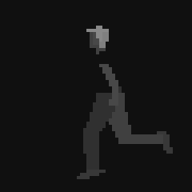
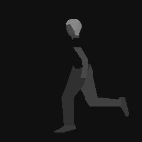

# Another World 20th Anniversary Edition (WiiU)

Technical notes on the WiiU release.

## Resource Bundle

The content directory of the game contains the music files (.OGG) and one resource bundle (.BIN)

```
content/
├── archive.bin
└── game
    └── OGG
        ├── amb5001.ogg
        ...
        └── amb5011.ogg
```

The file archive.bin contains the game data files.

The offset to the entries table and the number of entries are stored at the end of the file as 32 bits
big endian integers (BE32).

Resource table entries format.

Field | Type | Details
----- | ---- | -------
File name              | \0 terminated string | File path
Uncompressed file size | BE32 | File size after decompression
File size              | BE32 | File size in the resource bundle
Data offset            | BE32 | File data offset in the resource bundle
Flags                  | BE32 | Either 0 or 1

Data is compressed with [LZ4](https://github.com/lz4/lz4).

## Data Files

File  | Details
----- | -------
game/awt/data1728x1080/ | 1080p texture backgrounds
game/bmp/data1280x800/  | 800p texture backgrounds (with a corrupted or incomplete palette ? maybe left-over)
game/dat/*mac           | bytecode
game/dat/*mat           | polygons (shapes)
game/dat/*pal           | RGB444 palette colors (Amiga)
game/txt/*txt           | strings ('Good evening professor.')
game/wgz_mixed/*wav     | sound files

The 20th anniversary editions of Another World on consoles use higher resolution graphics than
the Linux/Mac/Windows releases (1080p vs 800p).

## Textures

The .awt (Another World Texture ?) files are the background pictures.
The image pixels are stored as uncompressed RGBA (4 bytes). The file has a 12 bytes footer.
Image dimensions are stored as 16 bits big endian integers (BE16).

```
08 08 08 08 : RGBA color component depth ?
BE16        : aligned width
BE16        : height
BE16        : width
BE16        : height
```

## Game Code

The game bytecode contains two variants, one for the original low-resolution (320x200) and another one for 'HD' (1280x800).

Name   | Part  | Files
------ | ----- | -----
Intro  | 16001 | intro2011(hd).mac/.mat
Eau    | 16002 | eau2011(hd).mac/.mat
Prison | 16003 | pri2011(hd).mac/.mat
Cite   | 16004 | cite2011(hd).mac/.mat
Arene  | 16005 | arene2011(hd).mac/.mat
Luxe   | 16006 | luxe2011(hd).mac/.mat
Final  | 16007 | final2011(hd).mac/.mat

The only difference between the 'SD' and 'HD' bytecode files appear to be related to the polygons offsets, as expected.

```
$ diff -u intro2011.mac.asm intro2011hd.mac.asm
...
-033A: (FA) drawShape(code=0xFA, x=160, y=100); // offset=0xF5F0 (bank1.mat)
+033A: (FB) drawShape(code=0xFB, x=160, y=100); // offset=0xF608 (bank1.mat)
 033E: (18) playSound(res=44, freq=15, vol=63, channel=2)
...
```

An example of polygons upscale (SD vs HD .mat shape) :

 


## Bytecode Variables

The game engine communicates with the game code via special variables.

Index | Details
----- | -------
0xBF  | Game difficulty (0 to 2)
0xDB  | Enable sounds preloading (resource >= 2000)
0xDE  | Enable playback of remastered sounds (set to 0 when running the game in original low resolution)


## Debugging Information

The .elf executable has a symbol table section.

```
$ rpl2elf AnotherWorld_WiiU.rpx
$ readelf -S AnotherWorld_WiiU.elf
...
  [23] .symtab SYMTAB c0000000 301bf0 02ac90 10 A 24 24411 4
...

$ readelf -sW AnotherWorld_WiiU.elf | tr -s' ' | cut -d' ' -f9 | c++filt
...
CInterpret::LoadGamePart(int, int)
CInterpret::InterpretAll(void)
CInterpret::Interpret(unsigned short)
CInterpret::HandleControl(void)
...
CDisplay::LoadImage(char const *, unsigned char *, int *, int *)
CDisplay::LoadPal(char const *, unsigned int *)
CDisplay::SetWorkScreen(int)
CDisplay::ComputePalette(void)
CDisplay::SetScreen(int)
CDisplay::FillScreen(int, unsigned char)
CDisplay::CopyScreen(int, int)
CDisplay::LoadImage(int, unsigned char *, int *, int *)
CDisplay::DrawImage(int)
CDisplay::PrintAt(int, unsigned short, unsigned short, unsigned char)
CDisplay::DrawScaledPoint(int, int, unsigned char)
CDisplay::DrawShapeHD(unsigned char *, float, float, unsigned short, float, unsigned char)
CDisplay::DrawHead(int, int, bool)
CDisplay::DrawShape(unsigned char *, int, int, unsigned short, unsigned char)
```
